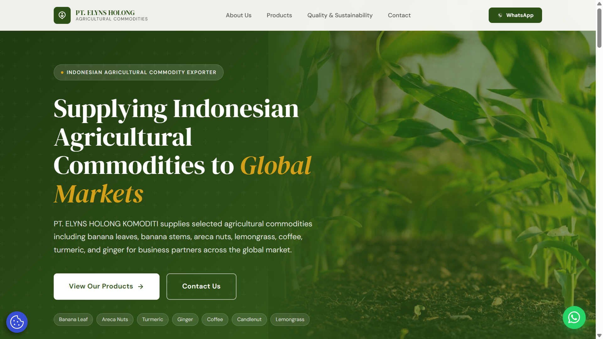
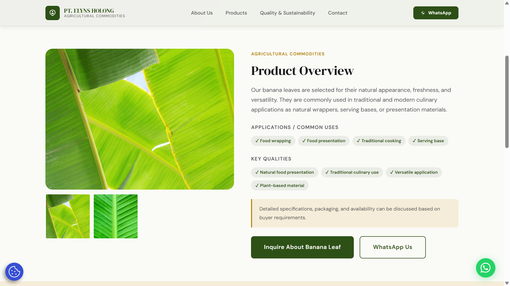
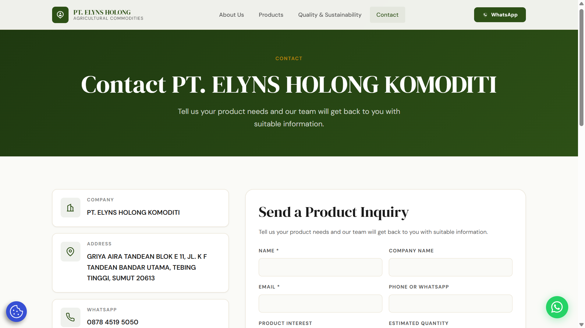

# Elyns Hoki Company Profile WordPress Theme

A custom WordPress theme developed for Elyns Hoki, an agricultural commodity distributor and exporter. The website presents the company profile, product catalog, gallery, contact information, WhatsApp access, and Google Maps location in a responsive and maintainable layout.

## Overview

This project was built as a custom WordPress theme to allow the website to be managed through WordPress while maintaining flexibility in layout, styling, and content structure. The theme was designed to support a professional company profile website with clear product presentation and customer inquiry flow.

## Features

- Responsive company profile landing page
- Product catalog sections
- About company section
- Vision and mission section
- Gallery section
- Contact form integration
- WhatsApp contact access
- Google Maps embed
- SEO-oriented content structure
- WordPress-manageable theme structure

## Tech Stack

- WordPress
- PHP
- HTML
- CSS
- JavaScript
- Custom WordPress Theme
- InfinityFree Hosting
- SMTP Plugin
- Google Maps Embed

## Role

Product Manager & Full-Stack Developer

Responsibilities included:

- Planning the website structure and user flow
- Developing the custom WordPress theme
- Structuring company and product content
- Implementing responsive layout adjustments
- Configuring deployment on InfinityFree
- Setting up contact form and SMTP integration
- Embedding WhatsApp access and Google Maps location

## Live Website

https://elynshoki.infinityfreeapp.com

## Screenshots

### Homepage

### Product Overview Page

### Contact Page

## Notes

This repository contains the custom WordPress theme source code and documentation only. WordPress core files, plugins, uploads, database files, and sensitive configuration files are excluded.
